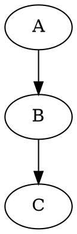

# dot2slides

Convert annotated [graphviz](http://www.graphviz.org/) dot files into
simple web slides.

## Quick start

1. Create a dot file representing your slide.



2. Add a comment tag to elements indicating when and how they should appear


3. Process the file using dot
```sh
% dot file.dot -Tsvg -o file.svg
```

4. Process the svg using addclass.js
```sh
% node addclass.js file.svg > slide.html
```

## Background

This is a hack.  I needed to convert a p*werpoint slide to the web and
didn't want to use ppt.  I noticed that graphviz/dot will happily create
SVG files and knew from experience with [d3](d3js.org) that I could make
something resembling my original slide by adding a few classes to the
SVG defining what elements should appear on each slide.

The main sticking point is that dot doesn't have the capability for the
user to define classes for generated svg elements.  My hack is to use
the comment feature, which dot dumps as comments in the SVG output, to
specify slide membership and to post-process this using
[jquery](https://npmjs.org/package/node-jquery) to traverse the DOM and
read the comments for elements that should be classed for different
display.

The actual slideshow capabilities are rendered using d3 to add the
"active" class the elements of the active slide and css to style
accordingly.

